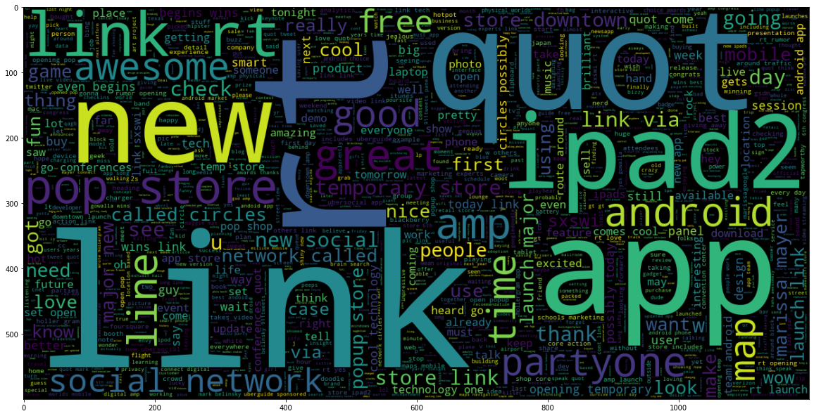
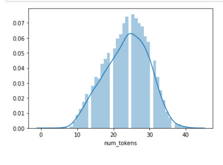
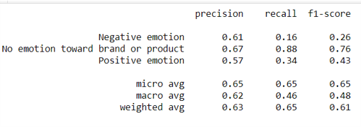
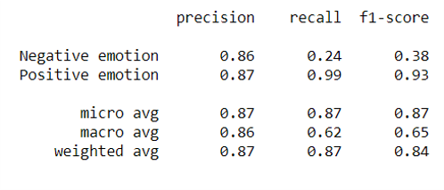
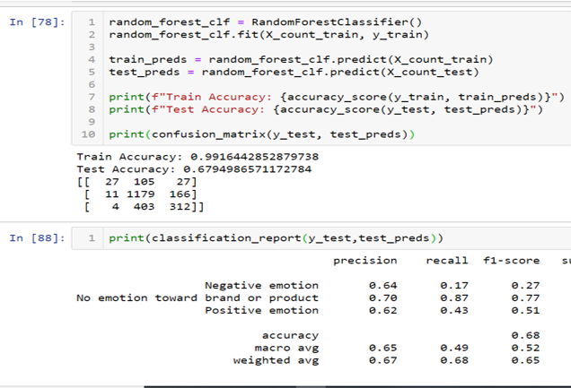

# Module 4 Final Project: NLP Sentiment analysis

## Introduction

Student name: Joey Husney
Student pace: full time
Scheduled project review date/time: N/A
Instructor name: Yish Lim

## Business Case
As a 3rd party independent contractor, we have been asked by various companies such as Apple and Google to determine how they can increase customer satisfaction by first identifying the features that customers are most unhappy with and then finding creative solutions to enhance these features. One of our methods of accomplishing this is to mine a database of tweets with manually encoded sentiments for each corresponding tweet. In so doing we can easily determine which products/services customers feel negatively towards. With that information, they have asked us to hand them the code that will help them predict the emotion towards a tweets so they can systematically organize future tweets without manually inputting sentiments. Ultimately our job is to create a model which can predict future tweet sentiment so they can decide which areas need improvement in order to enhance their customers experience.

## The Data
The Data
The dataset used in this project is available on data.world here. It is called Brands and Product Emotions and it contains a little over 9000 rows of tweets. Each tweet has a manually encoded emotion paired with it (positive, negative, or no emotion).

## EDA

##  Modeling

## Conclusion
What we have seen thus far is as follows:
* Vanilla Model with neutral emotion: 0.67 accuracy score
* Vanilla Model including just pos and neg emotions: 0.87 accuracy score
* Random forest model with preprocessing (count vectorizer): 0.68 accuracy
* Random forest model with preprocessing (Tfidf vectorizer): 0.679 accuracy

## Insights:
* Seems not to have made much of a difference which vectorizer used.
* Future work will be to get to the bottom of why scores didn't change for the most part
* Preprocessing doesn't seem to have made much of a difference either

## Future work:
* Try some different models out
* Figure out how to balance distribution in NLP project
* Next step is to organize tweets by product and make business recommendations based on that
